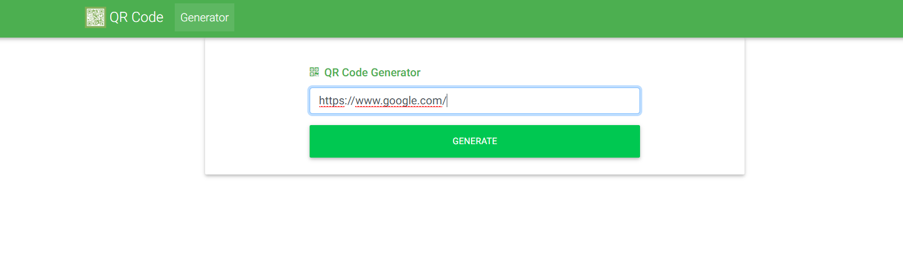
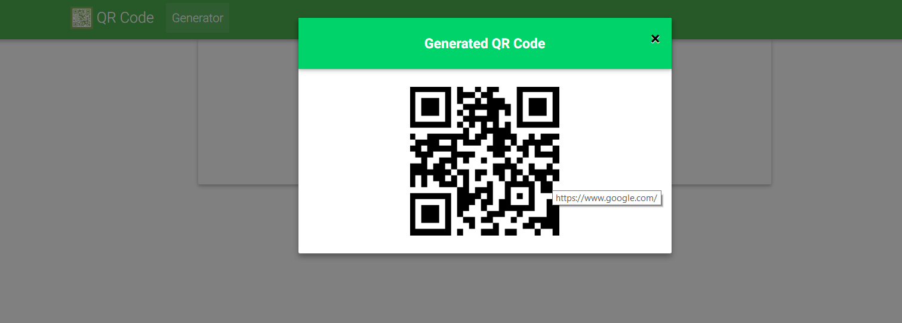
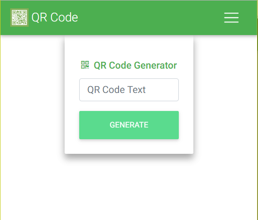

# QR Code Generator
QR Code Generator App based on angular 6 with Material Bootstrap.






## Demo
You may want to have a look at the demo: https://vgupta1192.github.io/qr-code-generator/

### Dependencies
```
npm install --save angularx-qrcode angular-bootstrap-md font-awesome hammerjs chart.js@2.5.0
```

### App Details
```
App can be used to generate different kinds of QR Code and can be scanned on phones as well.
```

### app.component.html
``` html
<mdb-navbar SideClass="navbar navbar-expand-lg navbar-dark green">
  <mdb-navbar-brand><a class="navbar-brand" href="#">
       QR Code</a></mdb-navbar-brand>

  <links>

    <ul class="navbar-nav mr-auto">
      <li class="nav-item active">
        <a class="nav-link waves-light" mdbWavesEffect>Generator
          <span class="sr-only">(current)</span>
        </a>
      </li>
    </ul>

  </links>
</mdb-navbar>

<div class="jumbotron text-center hoverable p-4 w-50 mx-auto">

  <div class="row">

    <div class="col-md-8 text-md-left mx-auto mt-3">

      <a href="#!" class="green-text">
        <h6 class="h6 pb-1"><i class="fa fa-qrcode pr-1"></i> QR Code Generator</h6>
      </a>

      <p class="font-weight-normal">
        <input [(ngModel)]="qrCodeDataEntered" placeholder="QR Code Text" class="form-control">
      </p>

      <button mdbBtn color="success" [disabled]="qrCodeDataEntered === ''" class="relative waves-light btn btn-block wow fadeInDown"
        data-wow-delay="0.4s" (click)="onSubmit(qrCodeDataEntered)" mdbWavesEffect>Generate</button>

    </div>
  </div>
</div>

<div mdbModal #QRModal="mdbModal" class="modal wow fadeIn" tabindex="-1" role="dialog" aria-labelledby="myQRModalLabel"
  aria-hidden="true">
  <div class="modal-dialog modal-notify modal-success" role="document">
    <div class="modal-content">
      <div class="modal-header">
        <button type="button" class="close pull-right" aria-label="Close" (click)="onClose()">
          <span aria-hidden="true">×</span>
        </button>
        <p class="heading lead font-weight-bold mx-auto">Generated QR Code</p>
      </div>
      <div class="modal-body mx-auto">
        <app-qr-code-generator [qrCodeDataEntered]="qrCodeDataShow" [size]="200" *ngIf="qrCodeDataShow !== '' "></app-qr-code-generator>
      </div>
    </div>
  </div>
</div>


```
### app.component.ts
``` typescript
import { Component, ViewChild } from '@angular/core';

@Component({
  selector: 'app-root',
  templateUrl: './app.component.html',
  styleUrls: ['./app.component.scss']
})
export class AppComponent {
  @ViewChild('QRModal') QRModel: any;

  public qrCodeDataEntered = '';
  public qrCodeDataShow = '';

  constructor() {}

  onSubmit(value: string) {
    this.QRModel.show();
    this.qrCodeDataShow = value;
  }

  onClose() {
    this.QRModel.hide();
    this.qrCodeDataEntered = '';
  }
}

```
### qr-code.component.ts
``` typescript
import {Component, ElementRef, Input, OnChanges, OnInit, SimpleChange} from '@angular/core';
import * as QRCode from 'qrcodejs2';

@Component({
  selector: 'app-qr-code-generator',
  template: ''
})
export class QrCodeComponent implements OnChanges, OnInit {
  @Input() public qrCodeDataEntered: string;
  @Input() public size: number;
  public generatedQRCode: QRCode;

  constructor(public elementRef: ElementRef) {}

  public ngOnInit() {
    this.generatedQRCode = new QRCode(this.elementRef.nativeElement, {
      colorDark: '#000000',
      colorLight: '#ffffff',
      correctLevel: QRCode.CorrectLevel['M'],
      height: this.size,
      text: this.qrCodeDataEntered,
      useSVG: false,
      width: this.size
    });
  }

  public ngOnChanges(changes: { [propertyName: string]: SimpleChange }) {
    if (!this.generatedQRCode) {
      return;
    }

    const changedQrCode = changes['qrCodeDataEntered'];

    if (changedQrCode) {
      this.generatedQRCode.clear();
      this.generatedQRCode.makeCode(changedQrCode.currentValue);
    }
  }
}


```
### app.module.ts
```
import { BrowserModule } from '@angular/platform-browser';
import { NgModule, NO_ERRORS_SCHEMA } from '@angular/core';
import { MDBBootstrapModule } from 'angular-bootstrap-md';
import { FormsModule } from '@angular/forms';
import { QRCodeModule } from 'angularx-qrcode';

import { AppComponent } from './app.component';
import { QrCodeComponent } from './qr-code/qr-code.component';


@NgModule({
  declarations: [
    AppComponent,
    QrCodeComponent
  ],
  imports: [
    BrowserModule,
    FormsModule,
    QRCodeModule,
    MDBBootstrapModule.forRoot()
  ],
  schemas: [ NO_ERRORS_SCHEMA ],
  providers: [],
  bootstrap: [AppComponent]
})
export class AppModule { }"# qr-code-generator" 
